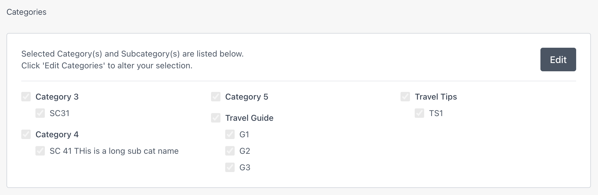
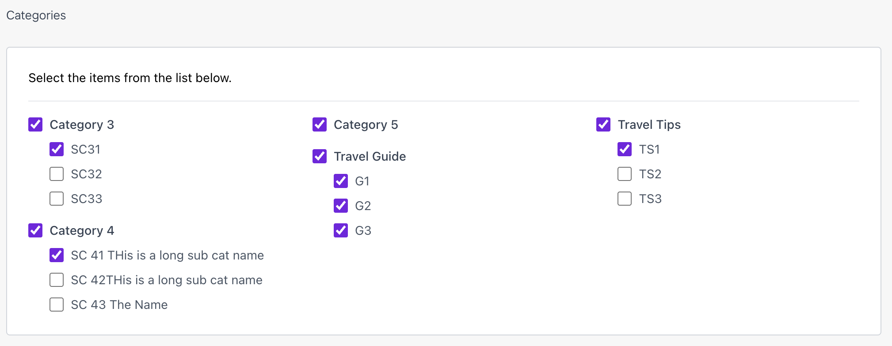

# Category Picker - Agility CMS App

A custom field application for Agility CMS that enables content editors to easily select categories and subcategories from Agility CMS lists. This app provides a hierarchical checkbox interface for managing category selections, with automatic parent-child relationship handling.

## Overview

The Category Picker app is built using the [Agility Apps SDK v2](https://agilitycms.com/docs/apps/apps-sdk) and provides a custom field that allows editors to:

- Select categories and subcategories from Agility CMS lists
- View selections in a clean, organized interface
- Automatically maintain parent-child relationships (selecting a subcategory ensures its parent category is selected)
- Store selections as comma-separated IDs in separate fields

## Features

### User Interface

- **Read-Only View**: Displays currently selected categories and subcategories in a responsive multi-column layout
- **Edit Mode**: Interactive checkbox interface for selecting/deselecting categories and subcategories
- **Responsive Design**: Automatically adjusts column count based on screen width (1-3 columns)
- **Visual Feedback**: Clear indication of selected items with disabled checkboxes in read-only mode

### Screenshots

**Read-only view** — displays selected categories with their subcategories in a responsive multi-column layout. Click "Edit" to modify selections:



**Edit mode** — interactive checkboxes for selecting categories and subcategories. Selecting a subcategory automatically selects its parent category; deselecting a category removes all its subcategories:



### Data Management

- **Hierarchical Relationships**: Automatically ensures parent categories are selected when subcategories are chosen
- **Bidirectional Updates**: Deselecting a category removes all its subcategories
- **Field Storage**: Stores category and subcategory IDs as comma-separated values in two separate fields
- **Real-time Updates**: Changes are saved immediately when selections are made

## How It Works

### Architecture

The app follows the Agility Apps SDK v2 architecture:

1. **App Definition**: Defined in `/.well-known/agility-app.json` with field capabilities and configuration values
2. **Custom Field**: Implemented at `/app/fields/ArticleCategoryField/page.tsx`
3. **Management API Integration**: Fetches categories and subcategories directly from Agility CMS using the Management API
4. **Data Storage**: Saves selections to two separate fields in the content item

### Data Flow

1. **Initialization**: The field loads and retrieves configuration values from the app installation context
2. **Data Fetching**: Uses the Management API to fetch categories and subcategories from specified lists
3. **State Management**: Maintains selected category and subcategory IDs in React state
4. **Field Updates**: When selections change, updates are saved to the content item using `contentItemMethods.setFieldValue()`
5. **Persistence**: Values are stored as comma-separated strings in two separate fields

### Configuration Values

The app supports four configuration values that can be set during installation:

| Configuration                    | Default                | Description                                                       |
| -------------------------------- | ---------------------- | ----------------------------------------------------------------- |
| `categoriesListReferenceName`    | `ArticleCategories`    | The reference name of the list containing categories              |
| `subcategoriesListReferenceName` | `ArticleSubCategories` | The reference name of the list containing subcategories           |
| `categoryIdsFieldName`           | `CategoriesIDs`        | The field name where category IDs are stored (comma-separated)    |
| `subcategoryIdsFieldName`        | `SubcategoriesIDs`     | The field name where subcategory IDs are stored (comma-separated) |

## Installation

### Prerequisites

- Node.js 18+ and npm/yarn
- An Agility CMS instance
- Access to the Agility CMS Management API

### Local Development Setup

1. **Clone or download the repository**

2. **Install dependencies**

   ```bash
   npm install
   # or
   yarn install
   ```

3. **Run the development server**
   ```bash
   npm run dev
   # or
   yarn dev
   ```
   The app will run on `http://localhost:3001`

### Registering the App in Agility CMS

1. **Navigate to Organization Dashboard**

   - Go to your Agility CMS Organization Dashboard
   - Click on "Apps" → "Private Apps"
   - Click "+ Create Private App"

2. **Provide App Details**

   - **Name**: Category Picker (or your preferred name)
   - **URL**: Your publicly accessible app URL (e.g., `https://your-domain.com`)
   - **Description**: Brief description of the app
   - **Icon**: (Optional) Upload an icon

3. **Install in Your Instance**
   - Go to your Agility CMS instance
   - Navigate to "Settings" → "Apps"
   - Click "Register" and select your app
   - Configure the app settings (see Configuration section below)

For detailed instructions, see the [Creating Apps for Agility documentation](https://agilitycms.com/docs/apps/creating-apps-for-agility).

## Configuration

### During Installation

When installing the app in your Agility CMS instance, you'll be prompted to configure:

1. **Categories List Reference Name**: The reference name of your categories list (default: `ArticleCategories`)
2. **Sub-categories List Reference Name**: The reference name of your subcategories list (default: `ArticleSubCategories`)
3. **Category IDs Field Name**: The field name where category IDs will be stored (default: `CategoriesIDs`)
4. **Sub-Category IDs Field Name**: The field name where subcategory IDs will be stored (default: `SubcategoriesIDs`)

### Content Definition Setup

Before using the field, ensure your content definition includes two text fields:

1. **Category IDs Field**: A text field to store comma-separated category IDs

   - Field name should match `categoryIdsFieldName` from app configuration
   - Default: `CategoriesIDs`

2. **Subcategory IDs Field**: A text field to store comma-separated subcategory IDs
   - Field name should match `subcategoryIdsFieldName` from app configuration
   - Default: `SubcategoriesIDs`

### List Structure Requirements

Your Agility CMS lists must have the following structure:

**Categories List** (e.g., `ArticleCategories`):

- Must have a `Title` field
- Items will be identified by their `itemContainerID`

**Subcategories List** (e.g., `ArticleSubCategories`):

- Must have a `Title` field
- Must have a `ParentCategoryID` or `parentCategoryID` field that references the parent category's `itemContainerID`
- Items will be identified by their `itemContainerID`

## Usage

### Adding the Field to a Content Definition

1. **Edit Content Definition**

   - Go to "Content" → "Content Definitions" in Agility CMS
   - Select or create the content definition where you want to use the field

2. **Add Custom Field**

   - Click "Add Field"
   - Select "Custom Field" type
   - Choose "Sub-Category Picker" from the list of available custom fields
   - The field will appear in your content definition

3. **Configure Field Storage**
   - Ensure you have two text fields in your content definition:
     - One for category IDs (default: `CategoriesIDs`)
     - One for subcategory IDs (default: `SubcategoriesIDs`)
   - These fields will be automatically populated by the app

### Using the Field

1. **View Selections** (Read-Only Mode)

   - When editing a content item, the field displays currently selected categories and subcategories
   - Selected items are shown with disabled checkboxes
   - Click "Edit" to enter edit mode

2. **Select Categories** (Edit Mode)

   - Click "Edit" to enter edit mode
   - Check/uncheck categories and subcategories
   - Selecting a subcategory automatically selects its parent category
   - Deselecting a category automatically removes all its subcategories
   - Changes are saved automatically

3. **Save Content**
   - Category selections are saved immediately when made
   - Save the content item normally to persist all changes

## Technical Details

### Project Structure

```
category-picker/
├── app/
│   ├── fields/
│   │   └── ArticleCategoryField/
│   │       └── page.tsx              # Main field component
│   ├── api/
│   │   ├── categories/
│   │   │   └── route.ts             # Categories API endpoint (stub)
│   │   ├── subcategories/
│   │   │   └── route.ts             # Subcategories API endpoint (stub)
│   │   └── app-uninstall/
│   │       └── route.ts             # Uninstall webhook handler
│   ├── layout.tsx                    # Root layout
│   └── page.tsx                      # Home page
├── lib/
│   ├── fetchData.ts                  # Data fetching logic
│   ├── getMgmtAPIUrl.ts              # Management API URL helper
│   └── mgmt-api-call.ts              # Management API client
├── public/
│   └── .well-known/
│       └── agility-app.json          # App definition
├── types/
│   └── index.ts                      # TypeScript types
└── package.json
```

### Key Technologies

- **Next.js 16**: React framework for building the app
- **Agility Apps SDK v2**: SDK for integrating with Agility CMS
- **TypeScript**: Type-safe development
- **Tailwind CSS**: Utility-first CSS framework

### SDK Methods Used

The app uses several methods from the Agility Apps SDK:

- `useAgilityAppSDK()`: Access SDK context, content item, and configuration
- `useResizeHeight()`: Automatically adjust iframe height
- `getManagementAPIToken()`: Get authentication token for Management API calls
- `contentItemMethods.setFieldValue()`: Update field values in the content item

### Data Storage Format

The app stores data as comma-separated values in two separate fields:

**Category IDs Field** (e.g., `CategoriesIDs`):

```
"1,2,3"
```

**Subcategory IDs Field** (e.g., `SubcategoriesIDs`):

```
"4,5,6,7"
```

This format allows for easy parsing and integration with other systems.

### Management API Integration

The app fetches data directly from Agility CMS using the Management API:

- **Authentication**: Uses `getManagementAPIToken()` from the SDK
- **API Endpoints**: Calls `/instance/{guid}/{locale}/list/{listRef}` endpoints
- **Multi-Region Support**: Automatically detects and uses the correct Management API URL based on instance GUID
- **Error Handling**: Includes proper error handling for API failures

## Development

### Building for Production

```bash
npm run build
# or
yarn build
```

### Running Production Build

```bash
npm start
# or
yarn start
```

### Environment Variables

No environment variables are required. The app uses the Agility Apps SDK to access instance information and authentication tokens.

## Troubleshooting

### Field Not Appearing

- **Check App Installation**: Ensure the app is installed in your Agility CMS instance
- **Verify Field Registration**: Check that the field is added to your content definition
- **Browser Console**: Check for JavaScript errors in the browser console

### Categories Not Loading

- **Verify List Names**: Ensure the list reference names in app configuration match your actual lists
- **Check List Structure**: Verify your lists have the required fields (`Title`, `ParentCategoryID`)
- **API Permissions**: Ensure the app has proper permissions to access the Management API
- **Network Tab**: Check the browser's network tab for failed API requests

### Selections Not Saving

- **Field Names**: Verify the field names in your content definition match the app configuration
- **Field Types**: Ensure the storage fields are text fields (not other types)
- **Browser Console**: Check for errors when saving

### Authentication Issues

- **Token Expiration**: Management API tokens may expire; the app should handle this automatically
- **Permissions**: Ensure the app has been granted proper permissions during installation

## API Routes

The app includes API routes for development/testing purposes:

- `/api/categories`: Returns stub category data (for development)
- `/api/subcategories`: Returns stub subcategory data (for development)
- `/api/app-uninstall`: Handles app uninstallation webhook

**Note**: In production, the app fetches data directly from Agility CMS using the Management API, not these routes.

## App Definition

The app definition file (`/.well-known/agility-app.json`) defines:

- App metadata (name, version, description)
- Configuration values
- Field capabilities
- Uninstall hook endpoint

See the [Apps SDK Documentation](https://agilitycms.com/docs/apps/apps-sdk) for details on app definitions.

## Best Practices

1. **List Organization**: Keep your categories and subcategories lists well-organized
2. **Field Naming**: Use consistent naming conventions for your storage fields
3. **Performance**: For large lists (100+ items), consider pagination or search functionality
4. **Validation**: Add validation to ensure required categories are selected
5. **Documentation**: Document your category structure for content editors

## Resources

- [Agility Apps SDK Documentation](https://agilitycms.com/docs/apps/apps-sdk)
- [Creating Apps for Agility](https://agilitycms.com/docs/apps/creating-apps-for-agility)
- [Agility CMS Management API](https://agilitycms.com/docs/management-api)
- [Next.js Documentation](https://nextjs.org/docs)

## Support

For issues or questions:

- Check the [Agility CMS Documentation](https://agilitycms.com/docs/)
- Review the [Apps SDK Documentation](https://agilitycms.com/docs/apps/apps-sdk)
- Contact Agility CMS Support

## License

This project is licensed under the MIT License.

---

Made with ❤️ for the Agility CMS community
